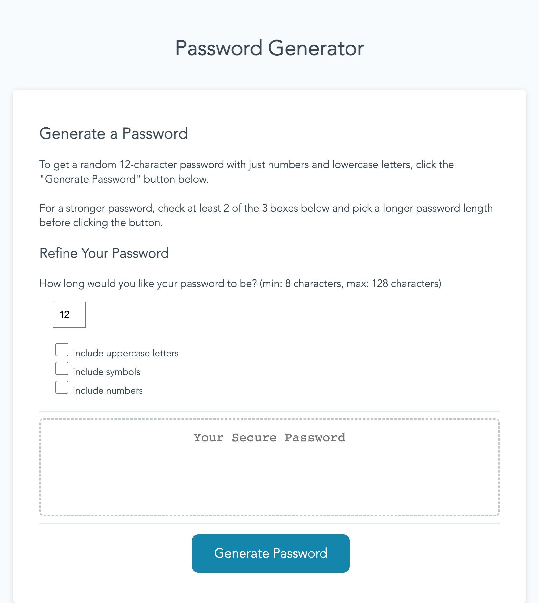

# Challenge 3: Password Generator

## About
The purpose of this assignment was to create a random password generator, using JavaScript, allowing users to define criteria (length, inclusion of different character types) and click a button to get a randomly generated password. 

The webpage should look like this:

## Installation
N/A

## Contributions
Several resources were used to help implement the desired functionality of this webpage:

* [geeksforgeeks tutorial on creating random password generators using vanilla javascript](https://www.geeksforgeeks.org/how-to-generate-a-random-password-using-javascript/)

* [geeksforgeeks tutorial on changing size of form inputs](https://www.geeksforgeeks.org/how-to-set-checkbox-size-in-html-css/)

* [stack overflow thread on creating random string with requirements](https://stackoverflow.com/questions/9719570/generate-random-password-string-with-requirements-in-javascript)

* [w3collective tutorial on creating a random password generator using vanilla javascript](https://w3collective.com/random-password-generator-javascript/)

* [w3 schools tutorial on javascript form validation](https://www.w3schools.com/js/js_validation.asp)

## License
Please see license in repo.